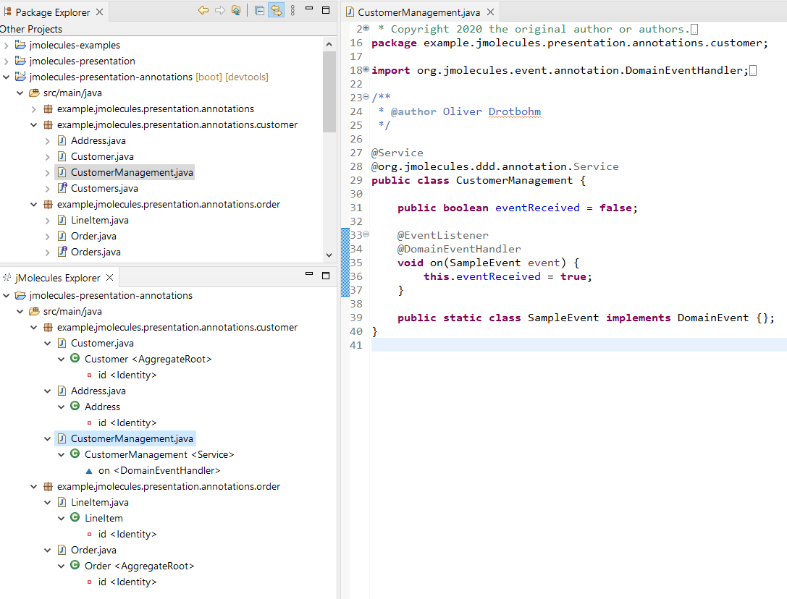

# JMolecules for Eclipse Plugin

The JMolecules for Eclipse Plugin supports developers to use JMolecules, i.e. to implement domain models in distraction-free, plain old Java.

## Features

The JMolecules for Eclipse Plugin provides the following features:

### JMolecules Explorer

The explorer displays the structure of a selected project filtered by JMolecules relevant concepts.

## License
This code is open source software licensed under the [Apache 2.0 License](https://www.apache.org/licenses/LICENSE-2.0.html).
